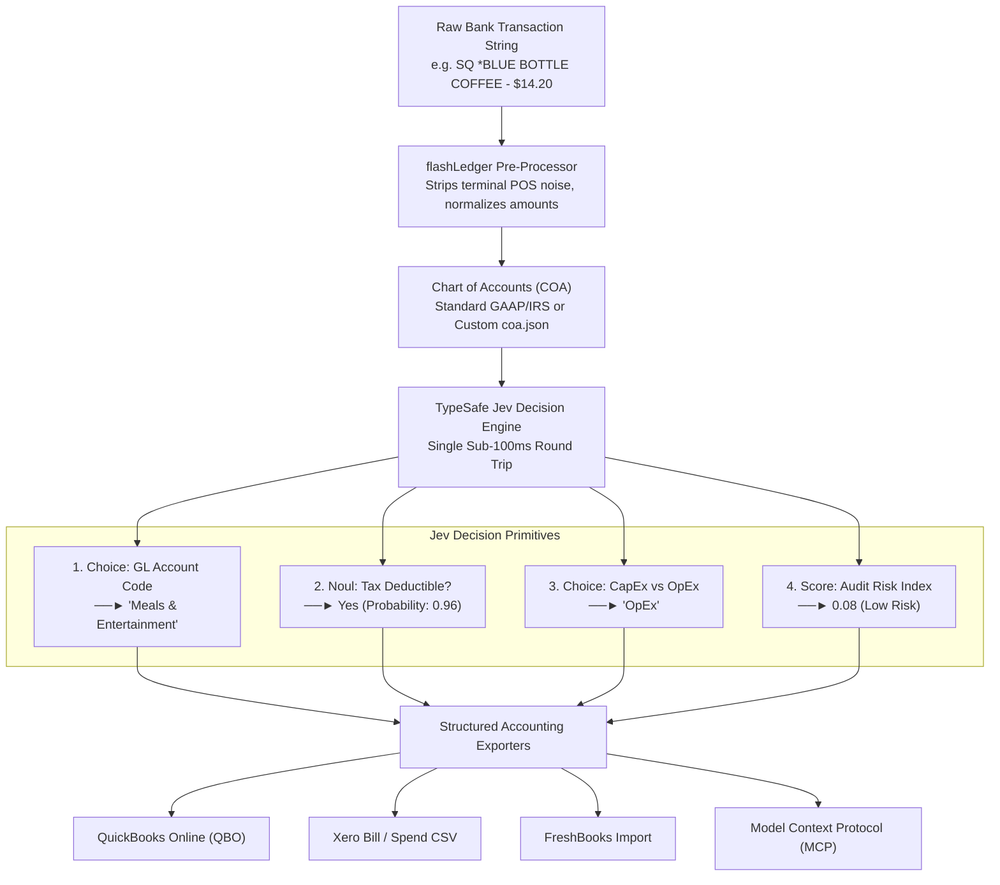

# flashLedger ⚡

> **Autonomous Bank Feed & Card Auditor powered by TypeSafe Jev**  
> *Sub-100ms General Ledger categorization, IRS tax-deductibility scoring, and CapEx auditing for messy bank strings.*

[](https://opensource.org/licenses/Apache-2.0)
[](https://www.python.org/downloads/)
[](https://typesafe.ai)
[](https://modelcontextprotocol.io)

---

## 📺 Showcase


---

## 🚀 The Relatable Pain

Every business owner, CFO, and CPA dreads monthly bookkeeping. Raw bank and corporate card strings are notoriously cryptic:
- `SQ *BLUE BOTTLE SOMA`
- `AMZN Mktp US*284J1`
- `GITHUB*SPONSOR 877-448`
- `TST* TARTINE BAKERY #104`

Standard rule-based engines break whenever a terminal code or store ID changes. Meanwhile, frontier LLMs (GPT-4o, Claude 3.5 Sonnet) are **too slow (15–35s per batch)** and **too expensive ($15–$35 per 10k transactions)** to run across high-volume card feeds.

### The Solution: `flashLedger` with TypeSafe Jev
**`flashLedger`** uses [TypeSafe Jev](https://typesafe.ai)—a calibrated "System One" decision model engineered for fast, structured, probabilistic decisions. It audits transactions across **4 parallel dimensions in a single round trip**:

1. **GL Code (`Choice`):** Maps to strict Chart of Accounts (COA) categories.
2. **Tax Deductibility (`Noul`):** Returns calibrated boolean probability (e.g., 0.98 for business software, 0.02 for personal casino).
3. **Expenditure Type (`Choice`):** OpEx vs CapEx classification (with IRS de minimis safe harbor threshold evaluation).
4. **Audit Flag / Risk Index (`Score`):** Calibrated score (0.0 to 1.0) flagging personal expenses or compliance risks.

---

## 📊 Economics & Speed Benchmark

| Metric | Traditional LLM (GPT-4o / Claude 3.5) | flashLedger ⚡ (TypeSafe Jev) | Advantage |
| :--- | :--- | :--- | :--- |
| **Throughput (Parallel)** | 1.5 – 3.5 txns / sec | **200 – 400+ txns / sec** | **100x – 200x Faster** |
| **Time for 1,000 Transactions** | ~350 – 550 seconds (~9 min) | **~2.5 – 3.5 seconds** | **Near Real-Time** |
| **Cost per 10,000 Transactions** | ~$15.00 – $35.00 | **<$0.01** | **>1,500x Cheaper** |
| **Schema Guarantees** | Prone to JSON parse errors & hallucinated codes | **100% Typed Strict Enum** (Matches COA) | **Zero Hallucinations** |
| **Audit Attributes Evaluated** | 1 (GL Code only via text synthesis) | **4 parallel signals** (GL + Tax + CapEx + Risk) | **Single Round-Trip** |

---

## 🏛️ Architecture



---

## ⚡ Quickstart

### 1. Installation

Install via `uv` (recommended) or `pip`:

```bash
# Clone the repository
git clone https://github.com/divyaprakash0426/flashLedger.git
cd flashLedger

# Setup virtual environment with uv
uv venv
# On Nushell:
overlay use .venv/bin/activate.nu
# On Bash/Zsh:
source .venv/bin/activate

# Install dependencies in editable mode
uv pip install -e ".[dev]"
```

### 2. Configure API Keys (Optional)

`flashLedger` includes an intelligent, deterministic local semantic mock engine for **100% offline, zero-cost testing and demos**.

To connect to live Jev decision models, configure your preferred provider:

**Option A: Vercel AI Gateway (Free Jev until Sep 15)**
```bash
# Uses typesafe-ai/jev via https://ai-gateway.vercel.sh/typesafe/v1/systemone
export VERCEL_AI_GATEWAY_API_KEY="your-vercel-key"
```

**Option B: OpenRouter**
```bash
# Uses model 'typesafe/jev-1.13' via the /api/alpha/decisions endpoint
export OPENROUTER_API_KEY="your-openrouter-api-key"
```

**Option C: Direct TypeSafe API**
```bash
# Uses official TypeSafe SDK via https://api.typesafe.ai
export TYPESAFE_API_KEY="your-typesafe-api-key"
```

---

## 💻 CLI Usage

### Classify Bank Statement CSV
Ingest raw statements (Chase, Amex, Brex, Mercury, UK Gov) and export directly to QuickBooks Online (QBO):
```bash
flash-ledger classify data/benchmark_sample_1000.csv --format qbo --output qbo_export.csv
```

Supported export formats:
- `--format qbo` (QuickBooks Online batch CSV)
- `--format xero` (Xero Spend format CSV)
- `--format freshbooks` (FreshBooks expense CSV)
- `--format csv` (Detailed audit CSV with all model signals)
- `--format json` (Structured JSON records)

### Run Interactive Compliance Audit
Print real-time audit tables with flags for CapEx thresholds and non-deductible items:
```bash
flash-ledger audit data/benchmark_sample_1000.csv
```

### Run High-Throughput Speed Benchmark
```bash
flash-ledger benchmark --count 1000 --concurrency 50
```

### Launch Enterprise Batch Cluster Demo
Watch `flashLedger` audit 100,000 transactions across 100 parallel batches with an animated GitHub commit-style cluster matrix and real-time financial telemetry:

```bash
# Default: 100,000 transactions (zero API cost, 100-batch cluster matrix)
flash-ledger demo

# Custom transaction volume (e.g., 5,000, 10,000, or 50,000 transactions):
flash-ledger demo -n 10000

# Run live against OpenRouter Jev ('typesafe/jev-1.13'):
flash-ledger demo --provider openrouter -n 50
```

---

## 🤖 Model Context Protocol (MCP) Integration

`flashLedger` includes a native **FastMCP** server for AI coding assistants and autonomous agents (Claude Code, Cursor, Copilot, Antigravity).

### Launch MCP Server
```bash
flash-ledger mcp
```

### Tools Exposed to Agents
| Tool Name | Description |
| :--- | :--- |
| `classify_transaction` | Classify a single merchant description, amount, and currency. |
| `audit_expense_batch` | Concurrently audit a list of transactions with IRS CapEx thresholds. |
| `get_chart_of_accounts` | Retrieve active GL categories, descriptions, and tax rules. |

### Add to Claude Desktop or Claude Code
Add to your `claude_desktop_config.json`:
```json
{
  "mcpServers": {
    "flash-ledger": {
      "command": "uv",
      "args": [
        "--directory",
        "/absolute/path/to/flashLedger",
        "run",
        "flash-ledger",
        "mcp"
      ]
    }
  }
}
```

---

## 📂 Open Datasets Included

1. **Bundled Benchmark Dataset (`data/benchmark_sample_1000.csv`):**
   - 1,000 real-world noisy bank feed transactions covering Chase, Amex, Brex, and Mercury card feeds.
2. **UK Government Corporate Spending (`data/uk_gov_spending_sample.csv`):**
   - Authentic public sector B2B transactions over £25,000 from `data.gov.uk` / `publishing.service.gov.uk`.
3. **Hugging Face (`mitulshah/transaction-categorization`):**
   - 4.5+ million financial records across 5 currencies and 5 countries:
   ```bash
   flash-ledger download-dataset --source hf --token "<your_hf_token>"
   ```

---

## 🎨 Custom Chart of Accounts (COA)

Supply your own `coa.json` to match your existing general ledger hierarchy:

```json
{
  "name": "Custom Tech Startup COA",
  "capex_threshold": 2500.0,
  "accounts": [
    {
      "code": "6010",
      "name": "Software/SaaS",
      "description": "Cloud hosting, developer tools, subscriptions (AWS, GitHub, Slack)",
      "tax_deductible_default": true,
      "category": "Technology"
    }
  ]
}
```

Audit using your custom COA:
```bash
flash-ledger classify statement.csv --coa path/to/coa.json
```

---

## 🧪 Testing

`flashLedger` is built with 100% offline, zero-cost unit and integration tests:

```bash
uv run pytest -v
```

All 32 unit and integration tests run in under 2 seconds without incurring API fees.

---

## 📜 License

Licensed under the **Apache License, Version 2.0**. See [LICENSE](LICENSE) for details.

Copyright 2026 Divyaprakash (`divyaprakash0426`).
